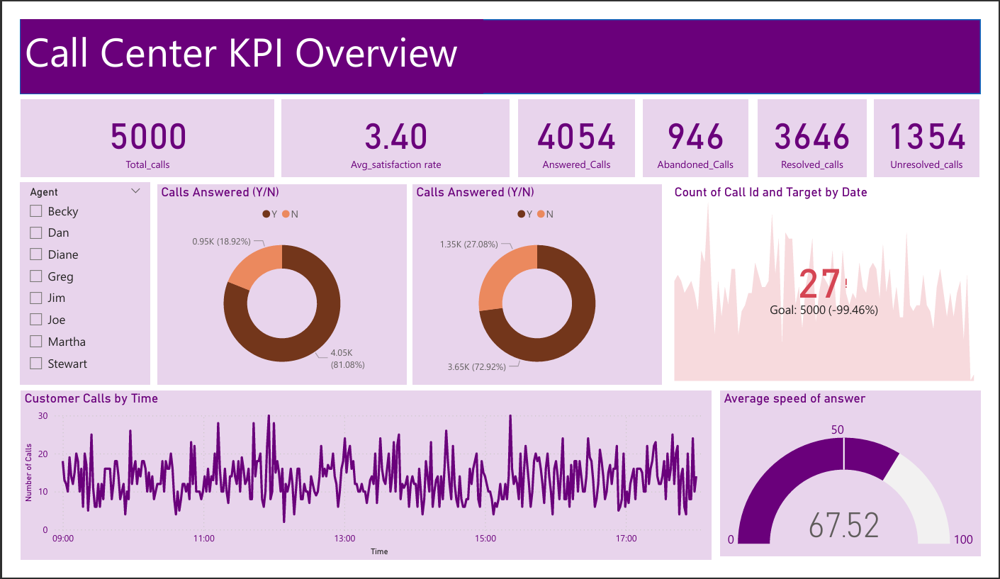
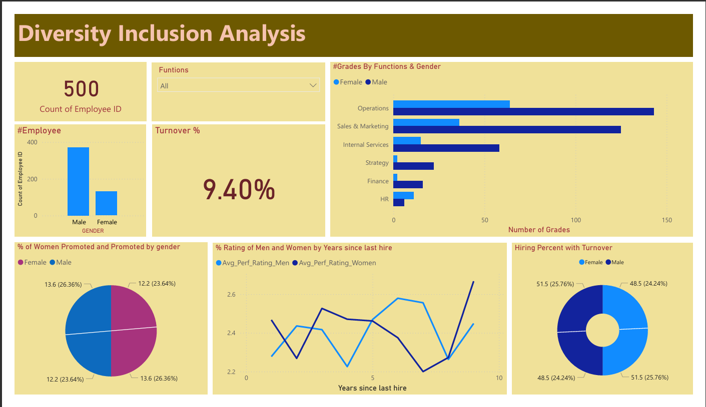
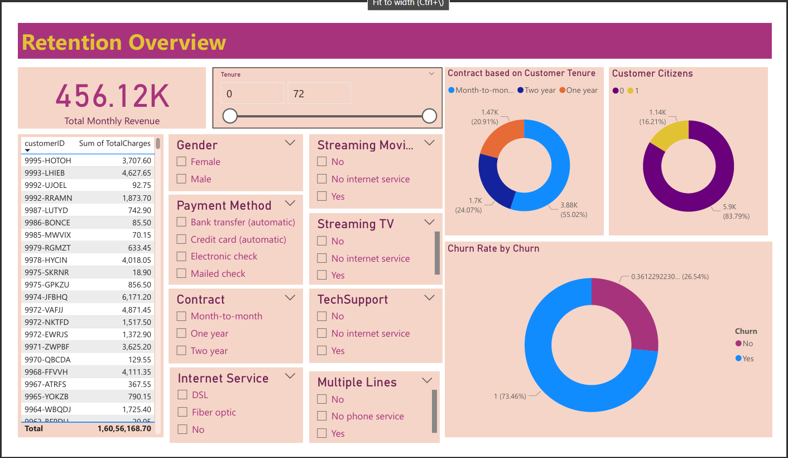

**Please Note: Please go through the PDF files "Call Center KPI Overview, Diversity_Inslusio_Analysis, Retention" to view Customer Churn Analysis dashboards.**

This project focuses on customer churn analysis using Power BI to identify key retention factors and optimize customer experience.
By analyzing a dataset of 7,043 customers, the goal is to uncover churn trends and provide actionable insights for reducing customer attrition.

Key Features:
- Dataset Analysis: Explored customer data, focusing on contract type, payment methods, and service usage patterns.
- Churn Risk Segmentation: Identified high-risk groups, revealing 41.89% churn in Fiber Optic users and 2.5x higher churn in month-to-month contracts.
- Visualization: Created interactive Power BI dashboards to track KPIs and support data-driven retention strategies.
- Business Impact: Proposed targeted retention efforts, such as loyalty incentives and digital payment optimizations, to reduce churn.

